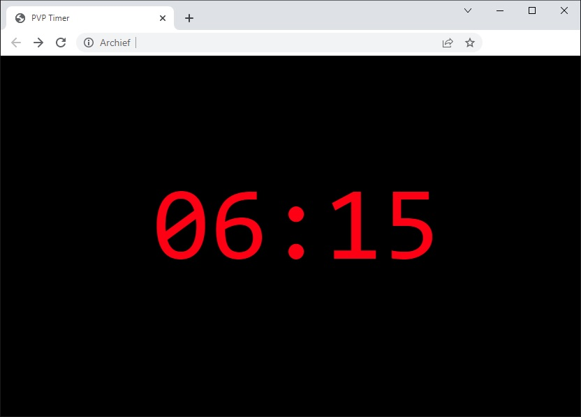

# PVPtimer

A simple web page to view the remaining time for a video playing on a specific layer in PVP. Timer format is (mm:ss). 



## Setup Instructions:
1. Copy `PVPtimer.html` to a computer (on same network as ProVideoPlayer).
2. Open `PVPtimer.html` in your favourite text editor and update the following values in the script code to suit your setup:
```
// ***** UPDATE THESE VALUES TO SUIT YOUR SETUP *******
var ipAddressOfPVPComputer = "172.20.10.53"; // IP Address of PVP computer (See Network Preferences)
var networkPortOfPVP = "8080"; // Port number PVP (See Network Preferences)
var layerId = "0"; // PVP Layer ID 
// ****************************************************
```

Tip: To show the timer on a Pro7 Stage Display you must host it on a webserver. Then simply add a web element to your Pro7 Stage Display.
